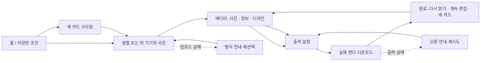

# XIV / ATELIER V3 — 제품 UI·카드 마스터 디자인 스펙

**상태:** 구현 기준  
**작성일:** 2026-10-08  
**대상:** 홈, 템플릿 탐색, 이미지 시작, 에디터, 결과 및 복구 화면과 세 카드 마스터  
**디자인 원본:** [Figma · 02 V3 product experience](https://www.figma.com/design/MqkXWfirWgjyyRbqGZjacF/XIV-Atelier-%E2%80%94-%EB%AA%A8%EB%B0%94%EC%9D%BC-UI---%EC%B9%B4%EB%93%9C-%EC%BD%98%EC%85%89%ED%8A%B8-3%EC%95%88?node-id=64-672)

이 문서는 사용자가 요청한 V3 시안을 제품 코드에 반영할 때의 시각·행동 기준이다. 이전 Editor V1 동결 문서는 해당 시점의 승인 기록으로 보존한다. 이번 사용자의 명시적 UI·UX 및 카드 재설계 요청은 이 문서가 정하는 V3 대상 화면에 대한 새 변경 승인이다. 기존 카드 데이터, 렌더러·내보내기, 저장, 직업 아이콘 원본, 접근성 동작의 경계는 계속 지킨다.

Figma는 화면과 주요 흐름을 보여주는 설계 자료다. 고정된 예시 입력, 장식, 연결된 프로토타입이 모두 실제 기능이라는 뜻은 아니다. 실제 파일 처리·저장·편집·출력 동작은 현재 제품 코드와 아래 보존 요구사항을 기준으로 구현한다.

## 1. 제품의 약속

XIV / ATELIER는 플레이어가 FINAL FANTASY XIV 스크린샷과 캐릭터 정보를 사용해 간직하고 공유할 모험가 카드를 만드는 브라우저 스튜디오다. 결과물은 게임 프로필을 읽기 쉽게 옮기는 데 그치지 않고, 스크린샷 속 한 장면과 캐릭터 정보를 사진집 표지, 영화 포스터, 모험가 기록물이라는 세 가지 인쇄물 스타일로 완성한다.

핵심 작업 흐름은 **스타일 선택 → 예시 또는 기기 내 사진 선택 → 사진과 정보 편집 → 결과 확인 및 파일 저장**이다. 기존 초안이 있으면 이어서 편집할 수 있어야 한다. 사용자는 어떤 단계에서도 사진·정보가 카드에 어떻게 나타나는지 미리 볼 수 있어야 한다.

제품 언어는 한쪽에서 통일하고 다른 쪽에서 의도적으로 분화한다.

- **앱 인터페이스:** 따뜻한 종이색, 진한 잉크, 절제된 버건디를 사용하는 조용한 편집 스튜디오. 장식보다 카드와 사용자의 사진을 먼저 보인다.
- **카드:** 세 마스터 각각의 소재·구도·정보 위계를 유지한다. 앱 UI 색이나 시스템 테마가 인쇄물 표면을 자동으로 바꾸지 않는다.
- **작업 감각:** 단계가 분명하고 언제든 되돌릴 수 있다. 현재 저장 상태와 오류를 명확히 알려 주며, 사용자의 사진과 초안을 잃지 않는다.

V3의 품질 기준은 고급 서체만 크게 배치하는 것이 아니다. 실제 캐릭터 사진, 정보의 우선순위, 여백, 소재 표현, 직업 표식이 하나의 완성된 작품처럼 맞물리고, 긴 이름과 다른 언어에서도 그 완성도를 유지해야 한다.

### 적용 대상 플랫폼

현재 저장소는 Next.js 기반 웹 앱이다. 이 문서의 모바일 화면은 현재 웹 제품을 390px 기준에서 사용하는 반응형 모바일 UI를 가리킨다. 저장소에서 확인되지 않은 Expo·React Native·Capacitor 네이티브 앱 셸이나 스토어 배포까지 완료됐다고 표현하지 않는다. 추후 네이티브 앱을 만들 때는 이 스펙을 화면 언어의 기준으로 재사용하되 플랫폼 구현과 동작을 별도로 검증한다.

## 2. 출처와 적용 순서

세부 토큰과 화면별 제작·검수 방법은 이 문서와 함께 관리한다.

1. [디자인 토큰](./DESIGN_TOKENS.md): UI 및 카드 표면의 컬러, 서체, 크기, 간격, 상태값
2. [화면별 AI 프롬프트](./SCREEN_AI_PROMPTS.md): 각 화면 시안 또는 구현 작업에 사용할 입력문
3. [AI 결과물 QA·수정 가이드](./AI_QA_REPAIR_GUIDE.md): 시안·구현 비교, 오류 분류, 수정 순서와 완료 기준

같은 항목에 설명이 다르면, 이 마스터 스펙은 **제품 의미·화면 구조·카드 구성**, 토큰 문서는 **구체적인 시각 값**, 프롬프트 문서는 **화면별 작업 입력**, QA 문서는 **검증 방법**을 결정한다. Figma 화면의 픽셀 값이나 텍스트 예시는 그 화면을 만든 캔버스의 시안 값이다. 해당 값이 이 제품의 실제 데이터·로직·모든 카드 비율의 고정 규칙이라는 증거가 없다면, 기존 코드의 지원 범위와 일치시켜 적용한다.

### 구현 자료

- [V3 앱 화면 Figma 페이지](https://www.figma.com/design/MqkXWfirWgjyyRbqGZjacF/XIV-Atelier-%E2%80%94-%EB%AA%A8%EB%B0%94%EC%9D%BC-UI---%EC%B9%B4%EB%93%9C-%EC%BD%98%EC%85%89%ED%8A%B8-3%EC%95%88?node-id=64-672): 모바일 14개, 데스크톱 6개, 합계 20개
- 카드 마스터: [Cinematic Gold](https://www.figma.com/design/MqkXWfirWgjyyRbqGZjacF?node-id=23-233), [Editorial Vermilion](https://www.figma.com/design/MqkXWfirWgjyyRbqGZjacF?node-id=23-273), [Adventurer Record](https://www.figma.com/design/MqkXWfirWgjyyRbqGZjacF?node-id=23-383)
- 카드 보드: [Cinematic Gold 보드](https://www.figma.com/design/MqkXWfirWgjyyRbqGZjacF?node-id=23-384), [Editorial Vermilion 보드](https://www.figma.com/design/MqkXWfirWgjyyRbqGZjacF?node-id=23-568), [Adventurer Record 보드](https://www.figma.com/design/MqkXWfirWgjyyRbqGZjacF?node-id=23-736)
- 관련 구현·계약: [`master-cards.md`](../master-cards.md), [`interaction-system.md`](../interaction-system.md), [`job-icon-sources.md`](../job-icon-sources.md), [`job-icon-source-cleanup.md`](../job-icon-source-cleanup.md), [`web-experience.md`](../web-experience.md)
- 관련 앱 구조: `src/components/cards/AdventurerCards.tsx`, `src/components/editor/card-preview.tsx`, `src/lib/master-card-config.ts`, `src/store/editor-store.ts`, `src/store/editor-persistence.ts`, `src/lib/card-export/index.ts`

## 3. 제품 UI 아트 디렉션

### 3.1 공통 언어

UI는 카드 작품을 담는 여백 있는 작업대다. 화면에서 장식용 테두리·배지·아이콘을 계속 반복하지 않는다. 표면은 종이처럼 따뜻하고, 주요 액션은 하나만 분명히 강조한다. 버건디는 선택·주요 액션·현재 상태를 표시하고 금색은 카드의 인쇄 장식에 한정한다. 정보 영역은 선과 간격으로 나누며, 앱 인터페이스를 카드 프레임이나 게임 대시보드처럼 꾸미지 않는다.

- 시선 순서는 **현재 작업과 카드 미리보기 → 해당 작업의 조절부 → 보조 경로**다.
- 한 화면의 주요 액션은 한 개의 시각적 우선순위를 갖는다. 편집 중에는 카드 미리보기와 내보내기를 언제나 찾을 수 있다.
- 입력에는 필드 이름과 값이 함께 보인다. 옵션은 선택·비선택·비활성 상태가 색만으로 구별되지 않도록 형태, 문구 또는 체크 표시도 쓴다.
- 인터페이스 문장은 짧고 구체적이다. 예시 인물과 임시 값은 샘플임을 알 수 있게 표시하고 사용자 정보처럼 위장하지 않는다.
- 사진 또는 카드에 장식 레이어가 겹치면 실제 사진의 얼굴과 필수 텍스트가 가려지지 않는지 확인한다.

### 3.2 서체 역할

표시 서체와 조작 서체의 역할을 분리한다. 기존 등록 서체와 라이선스 레지스트리를 재사용하고 화면마다 새 웹폰트를 추가하지 않는다.

- 영문 카드 표시용: Cinematic·Editorial 이름은 Cormorant Garamond 계열, Adventurer Record 이름은 DM Sans Black 900의 대문자 조판
- 한글 표시용: 기존 Noto Serif KR 계열
- 일본어 표시용: 기존 Noto Serif JP 계열
- UI와 읽기용 값: DM Sans 및 기존 CJK 산세리프 계열
- UI 라벨은 읽기 쉬운 크기·자간을 유지한다. 카드 마이크로카피는 실제 출력 픽셀에서도 확인한다.

정확한 폰트 패밀리 토큰, 글자 크기, 행간, 자간과 폴백 순서는 [디자인 토큰](./DESIGN_TOKENS.md)을 적용한다. 이름 글자 수에 따라 정체성을 바꾸거나 이름을 잘라내지 않는다. 현재 이름 측정·스크립트별 폰트 선택·안전한 줄바꿈 기능을 사용한다.

### 3.3 반응형 원칙

Figma의 기준 프레임은 모바일 **390×844**, 데스크톱 **1440×1080**이다. 이는 검토 기준이지 앱이 지원할 수 있는 화면 크기의 한계가 아니다.

- 모바일은 카드가 먼저 보이고, 조절부가 사진·정보·디자인 세 탭으로 아래에 이어진다. 전체 데스크톱 툴바를 작게 압축하지 않는다.
- 데스크톱은 도구·카드 스테이지·정보 인스펙터를 분리해 카드와 입력을 동시에 확인하게 한다.
- 너비 변화에 따라 카드는 종횡비를 보존하며 축소되고, 조작부는 읽을 수 있는 너비를 유지한다. 가로 스크롤을 요구하지 않는다.
- 모바일의 키보드, 안전 영역, 긴 폼, 바텀시트와 하단 고정 액션이 서로 가리지 않게 한다.
- 전환점은 기존 레이아웃 규칙과 [디자인 토큰](./DESIGN_TOKENS.md)의 브레이크포인트를 따른다. 새 수치를 임의로 중복 정의하지 않는다.

## 4. V3 카드 마스터

세 카드의 구도와 장식은 서로 다르지만, 동일한 인물 데이터·이미지 편집 상태·색상 모드·선택 비율을 사용한다. 프로덕션 카드의 단일 구성 진입점은 `CardPreview`와 현재 카드 마스터 렌더러다. 홈·갤러리·에디터·내보내기마다 카드 마크업이나 스크린샷 이미지를 따로 복제하지 않는다. V3 시안은 실제 사진과 텍스트로 렌더링되는 컴포넌트로 구현한다.

### 4.1 Cinematic Gold — 장면을 소장하는 영화 스틸

**인상:** 황혼·보케·깊은 녹색과 따뜻한 금빛. 한 장면을 둘러싼 정교한 금박 테두리와 모서리 문양, 화면 위의 절제된 문장, 화면 아래에서 주인공이 되는 이름과 주요 캐릭터 정보.

- 사진이 카드의 첫 번째 정보다. 사진은 넓게 사용하고 표정·손·주요 실루엣을 보존한다.
- 이름은 장면 아래나 정보와 만나는 영역에서 확실한 주인공이 된다. Job·Level·World는 절제된 한 줄 또는 정돈된 정보 줄로 지원한다.
- 장식은 사진의 프레임과 모서리에 집중한다. 무관한 별·인장·배지를 반복해서 채우지 않는다.
- 금색은 사진의 주조색과 대비되는 얇은 인쇄선·작은 장식에 쓴다. 글자 가독성을 금박 질감에 희생하지 않는다.
- 카드 표면의 그림자·그레인·비네트는 기존 카드 효과 모델과 재료 토큰으로 표현한다.

### 4.2 Editorial Vermilion — 붓결로 사진을 인쇄면에 끌어들임

**인상:** 밝은 종이, 비대칭 붓터치 실루엣 안에 담긴 인물 사진, 오른쪽 종이 면의 큼직한 이름과 정돈된 인적 사항, 아래쪽의 적마도사 고유 문양과 짧은 서명.

- 사진 마스크는 기존 물결 모양의 매끈한 대각선 대신, **불규칙한 붓터치 가장자리**로 보인다. 첨부된 V3 시안의 검정/잉크색 붓 실루엣은 사진을 담는 프레임이다.
- 붓 형태는 편집 가능한 벡터 클립 경로로 구현한다. 마스크 이미지를 새로 만들거나 런타임 마스크 파일을 도입하지 않는다. 원본 사진 픽셀을 붓결에 맞춰 변형하지 않는다.
- 붓결 가장자리는 충분히 거칠되 인물의 얼굴과 상체가 읽히고, 사진이 임의로 잘린 것처럼 보이지 않아야 한다. 실제 업로드 사진에서 밝고 어두운 배경을 함께 검수한다.
- 종이 면의 이름, 한 줄 소개, 주요 정보는 프레임·마스크에 먹히지 않아야 한다. 비대칭 사진을 만회하려고 텍스트를 과밀하게 배치하지 않는다.
- 큰 `RDM` 문자 워터마크를 쓰지 않는다. 선택한 직업의 **원본 XIVAPI 직업 아이콘**을 직업 표식으로 사용한다. 적마도사 예시의 출처는 프로젝트 로컬 `public/assets/ffxiv/jobs/xivapi/svg/red-mage.svg`이며 원본 형상 경로를 편집하거나 재작성하지 않는다. 다른 직업도 기존 승인 매니페스트·사용 크기 규칙을 따른다.
- 제공되지 않는 직업 원본을 추측해 그리지 않는다. 등록상 원본이 없는 Beastmaster는 기존 텍스트/약칭 대체를 쓴다.
- 붓 형태는 사진 마스크 역할만 한다. 큰 사진 밖의 의미 없는 장식 얼룩이나 중복된 카드 프레임을 추가하지 않는다.

### 4.3 Adventurer Record — 길드의 정밀한 인물 기록

**인상:** 위쪽의 몰입감 있는 초상, 아래쪽의 따뜻한 프리미엄 종이, 정교한 얇은 프레임과 균형 잡힌 데이터 그리드. 인물과 게임 정보를 수집용 길드 기록물처럼 보존한다.

- 세로 카드 상부는 인물 사진이 차지하고, 금빛 모서리 선과 한쪽 상단의 세로 깃발이 장면을 묶는다.
- 깃발의 표기는 장식용 별이 아니라 **`XIV`**다. 글자 조판으로 표현하며 별 문양을 대신 넣거나 숫자를 다른 형태로 합성하지 않는다.
- 현재 Figma의 Record 이름은 버건디 DM Sans Black 대문자다. 렌더링 단계에서만 대문자로 표시하며 저장된 이름을 바꾸지 않는다. 한글·일본어 이름은 굵은 Noto Sans와 실제 잉크 측정 기반 맞춤을 사용한다.
- 초상 아래에는 이름과 직업·레벨을 먼저 두고, World/DC, Race/Clan, Free Company/Grand Company, Languages/Play Styles 등 실제 사용 가능한 필드를 읽기 쉬운 그리드로 정리한다.
- 각 행의 픽토그램은 Globe·User·Shield·Network·Leaf·Message·Flag·Map처럼 해당 필드의 의미를 나타낸다. 임의의 일반 별 문양을 데이터 아이콘처럼 쓰지 않는다.
- 얇은 종이 프레임, 구분선, 인장 색은 조용한 종이 재질을 만든다. 모든 셀을 박스·배지로 감싸 폼 UI처럼 보이게 하지 않는다.
- 좁은 비율에서 정보가 좁아지면 선택 비율의 기존 가시성 우선순위대로 축약한다. 주요 항목을 자르거나 존재하지 않는 정보로 빈 공간을 채우지 않는다.

### 4.4 데이터와 인쇄물 규칙

현재 카드 구성의 필드 우선순위와 마스터 ID·표시 필드는 [`master-cards.md`](../master-cards.md) 및 `src/lib/master-card-config.ts`를 따른다.

- 채워진 필수 기본 필드는 보인다. 비어 있는 값은 생략하고 `Unknown`, 가짜 월드, 임의의 플레이어 번호를 만들지 않는다.
- 카드에 표시할 선택 정보는 실제 사용자 입력만 사용한다. 예시의 Coner, Moogle, Chaos, Red Mage, Ember Bloom은 시안용 샘플이다.
- 기본 예시는 실제 대표 데이터를 사용하며, UI 단계 카운터나 다운로드 성공은 실제 앱 상태에서 결정한다.
- 카드의 종이·잉크·필름 톤은 마스터 렌더러의 고정 카드 재료 모드로 유지한다. UI 테마 설정의 전환이 카드 색상이나 인쇄 재료를 바꾸지 않는다.
- 원본 직업 아이콘은 로컬 승인 XIVAPI 원본을 사용한다. 기존 매니페스트가 정한 용도별 크기·SVG/PNG 허용 규칙을 지킨다. 이전 수제 마스크, SDF, 재생성된 빌드 복사본은 다시 런타임에 넣지 않는다.
- 기존 사진·재료·폰트·게임 그래픽의 출처와 라이선스 표기를 보존한다. 비공식 팬 프로젝트라는 점과 Square Enix 관련 고지를 기존 프로젝트 방식으로 유지하며 공식 앱처럼 보이게 만들지 않는다.

### 4.5 카드 비율과 출력

Figma의 완성 예시는 4:5에 초점을 둔다. 앱의 실제 지원 범위는 4:5 하나로 축소하지 않는다. 현재 카드 및 내보내기는 **1:1, 4:5, 3:4, 9:16, 16:9**를 지원한다. 각 비율에 대해 이름·사진 초점·필수 데이터가 재배치되도록 기존 컨테이너 상대 규칙을 활용한다. 한 비율의 시안을 찌그러뜨려 다른 비율로 만들지 않는다.

내보내기 형식은 PNG와 WebP, 해상도 배율은 1×·2×·4×, PDF 인쇄 동작은 현행 제품 기능을 유지한다. 기본 기준 출력 크기는 1×에서 1:1 `1080×1080`, 4:5 `1080×1350`, 3:4 `1080×1440`, 9:16 `1080×1920`, 16:9 `1920×1080`이다. 기존 픽셀 수·긴 변 제한에 따라 실제 요청 배율이 제한되면 UI가 실제 픽셀 크기를 표시한다.

## 5. 화면 지도와 라우팅

아래 표는 Figma 노드와 현재 앱 라우트·UI 상태의 대응 기준이다. `/editor`의 모바일 탭, 직업 선택, 추가 정보 시트는 편집 작업의 하위 상태다. `/export`의 생성 중·완료·오류는 한 번의 실제 렌더·다운로드 상태 흐름이다. 별도의 계정·클라우드·가짜 다운로드 화면을 추가하는 뜻이 아니다.

### 5.1 모바일 14개 화면

| Figma 화면 / 노드 | 제품 상태 | 목표 동작 |
|---|---|---|
| Home · [69:673](https://www.figma.com/design/MqkXWfirWgjyyRbqGZjacF?node-id=69-673) | `/` 홈 | 카드 작품을 먼저 보여주고, 카드 만들기·스타일 둘러보기·저장한 초안 이어하기로 진입한다. |
| Template gallery · [69:785](https://www.figma.com/design/MqkXWfirWgjyyRbqGZjacF?node-id=69-785) | `/templates` 갤러리 | 세 마스터를 같은 대표 인물로 비교한다. 한 개를 명확히 선택하고 그 선택을 다음 단계로 넘긴다. |
| Choose a photo · [69:1032](https://www.figma.com/design/MqkXWfirWgjyyRbqGZjacF?node-id=69-1032) | `/create` 시작 | 샘플로 시작하거나 이 기기에서 지원되는 사진을 고른다. 사진 처리는 기존 로컬 이미지 파이프라인을 쓴다. |
| Editor canvas · [69:1073](https://www.figma.com/design/MqkXWfirWgjyyRbqGZjacF?node-id=69-1073) | `/editor` 기본 상태 | 카드 미리보기, 현재 저장 상태, Undo/Redo 및 사진·정보·디자인 탭을 보여준다. |
| Editor · Photo · [69:1148](https://www.figma.com/design/MqkXWfirWgjyyRbqGZjacF?node-id=69-1148) | `/editor` 사진 탭 | 미리보기 아래에 사진 교체·초점·크기 및 기본 보정 도구를 보여준다. |
| Editor · Information · [71:1051](https://www.figma.com/design/MqkXWfirWgjyyRbqGZjacF?node-id=71-1051) | `/editor` 정보 탭 | 이름·직업·레벨·월드·데이터센터 등 주요 값을 편집한다. |
| Editor · Additional details · [71:1145](https://www.figma.com/design/MqkXWfirWgjyyRbqGZjacF?node-id=71-1145) | `/editor` 추가 정보 시트 | 종족·부족·부대·언어·플레이 스타일·소개 등 실제 모델의 나머지 필드를 다룬다. |
| Editor · Design · [71:1239](https://www.figma.com/design/MqkXWfirWgjyyRbqGZjacF?node-id=71-1239) | `/editor` 디자인 탭 | 세 카드 유형, 비율, 서체·색상·효과의 현행 옵션을 찾기 쉬운 그룹으로 묶는다. |
| Job picker · [71:1506](https://www.figma.com/design/MqkXWfirWgjyyRbqGZjacF?node-id=71-1506) | `/editor` 직업 선택기 | 실제 직업 검색·분류·선택으로 캐릭터 값을 변경하고 닫은 뒤 선택값을 유지한다. |
| Export settings · [71:1567](https://www.figma.com/design/MqkXWfirWgjyyRbqGZjacF?node-id=71-1567) | `/export` 설정 | 미리보기, PNG/WebP, 해상도, 현재 픽셀 크기, PDF 인쇄와 실제 다운로드 액션을 제공한다. |
| Download complete · [71:1649](https://www.figma.com/design/MqkXWfirWgjyyRbqGZjacF?node-id=71-1649) | `/export` 성공 상태 | 실제 파일 생성과 다운로드 전달 후 파일명·비율·픽셀 정보 및 다시 받기·계속 편집·새 카드 동선을 제공한다. |
| Upload error · [71:1717](https://www.figma.com/design/MqkXWfirWgjyyRbqGZjacF?node-id=71-1717) | `/create` 오류 상태 | 어떤 형식을 다시 선택해야 하는지 설명한다. 기존 초안은 유지한다. |
| Exporting · [82:2044](https://www.figma.com/design/MqkXWfirWgjyyRbqGZjacF?node-id=82-2044) | `/export` 생성 중 상태 | 실제 렌더 단계와 진행률을 알리고 중복 생성·옵션 변경 상태를 적절히 막는다. |
| Export error · [82:2126](https://www.figma.com/design/MqkXWfirWgjyyRbqGZjacF?node-id=82-2126) | `/export` 오류 상태 | 재시도 또는 편집으로 돌아가는 길을 제공하며, 로컬 초안과 입력값을 유지한다. |

### 5.2 데스크톱 6개 화면

| Figma 화면 / 노드 | 제품 상태 | 목표 동작 |
|---|---|---|
| Home · [75:1523](https://www.figma.com/design/MqkXWfirWgjyyRbqGZjacF?node-id=75-1523) | `/` 홈 | 제품과 세 카드의 차이를 작품 중심으로 보여주고 만들기·스타일 탐색으로 안내한다. |
| Editor · [75:1851](https://www.figma.com/design/MqkXWfirWgjyyRbqGZjacF?node-id=75-1851) | `/editor` 편집 | 미리보기 캔버스, 사진·정보·디자인 도구, 세부 정보 인스펙터를 함께 배치한다. |
| Export result · [75:1976](https://www.figma.com/design/MqkXWfirWgjyyRbqGZjacF?node-id=75-1976) | `/export` 설정·결과 | 큰 출력 미리보기와 실제 포맷·해상도 설정 및 완료 상태를 한 화면 안에서 제공한다. |
| Template gallery · [75:2069](https://www.figma.com/design/MqkXWfirWgjyyRbqGZjacF?node-id=75-2069) | `/templates` 갤러리 | 세 디자인의 성격·사용 맥락·실제 카드 출력물을 비교한다. |
| Photo start · [75:2300](https://www.figma.com/design/MqkXWfirWgjyyRbqGZjacF?node-id=75-2300) | `/create` 시작 | 파일 열기·예시 사용·기존 초안 복귀를 안내한다. |
| Additional details · [82:2207](https://www.figma.com/design/MqkXWfirWgjyyRbqGZjacF?node-id=82-2207) | `/editor` 추가 정보 패널 | 데스크톱에서 보조 인물 정보를 카드 미리보기와 함께 편집한다. |

### 5.3 주요 흐름

템플릿 화면에서 고른 카드, 사용자가 준비한 이미지, 기존 초안은 기존 편집 상태로 이어져야 한다. 직접 예시로 시작하거나 업로드한 뒤 갤러리를 오가는 경우에도 새 임의 초안을 만들어 사용자의 기존 편집 데이터를 덮어쓰지 않는다. 기존 프로젝트의 샘플 덮어쓰기 확인 동작도 유지한다.

## 6. 에디터 기능 매핑

Figma는 에디터를 **사진·정보·디자인**의 세 작업 탭으로 단순화한다. 기존 여섯 패널의 기능을 제거하지 말고 아래처럼 묶는다.

| 모바일 작업 탭 | 포함할 기존 기능 | 표시 원칙 |
|---|---|---|
| 사진 | 사진 파일 선택·교체, 위치 X/Y, 확대, 초기화, 회전·밝기·대비·채도·노출 고급 조절 | 자주 쓰는 초점·확대는 먼저, 고급 보정은 펼쳐서 접근한다. 조작과 동시에 같은 `CardPreview`를 갱신한다. |
| 정보 | 이름, 직업, 월드, 레벨, 데이터센터, 서비스/지역, 종족·부족, Free Company, Grand Company, 언어, Play Style, 한 줄 소개 | 우선 필드는 먼저 보이고 나머지는 추가 정보 시트에서 연다. 직업·월드 등 기존 정규화 선택기를 사용한다. |
| 디자인 | Cinematic·Editorial·Identity 마스터, 카드 비율, 타이포그래피 프리셋, Auto/Job/Custom 팔레트, 직업 모티프, 그레인·홀로그램 효과 | 마스터 비교를 사진 예시와 함께 제공한다. 옵션 그룹을 분리하고 저장·미리보기 상태를 유지한다. |

현행 내부 타입의 `screenshot`, `character`, `information`, `template`, `style`, `effects` 패널은 세 탭 아래의 하위 패널 또는 펼침 영역으로 남길 수 있다. 사용자가 이미 조작하는 기능, 직업별 테마 색, 카드 효과, 인쇄 비율을 시안에 예시가 없다는 이유로 제거하지 않는다.

### 정보 편집 계약

- 필드는 프로젝트의 `AdventurerCardCharacter` 및 정규화기를 사용한다. 임의 텍스트를 canonical job/world ID처럼 저장하지 않는다.
- 현재 서비스 지역은 `ko`, `en`, `ja`다. 실제 번역 사전을 사용하고, 번역되지 않은 게임 이름을 임의 번역하지 않는다.
- 직업 선택기는 실제 데이터의 분류·검색·선택 결과를 반영한다. 아이콘은 기존 `resolveJobIcon` 승인 경로에서 가져오고 누락·로딩 실패 때는 기존 텍스트/역할 마크로 표시한다.
- 언어·플레이 스타일 다중 선택 수와 제한, 이름·레벨 입력 검증, 스크린 리더 라벨을 보존한다.

## 7. 실제 제품 동작과 프로토타입의 경계

Figma 프로토타입은 큰 화면 이동을 연결하고, 샘플 `Coner / Editorial`로 화면의 외관을 보여준다. 다운로드는 약 1초 후 완료로 바뀌는 모의 흐름이고, 입력 폼과 옵션은 정적 디자인 예시이며, 실제 파일 처리 연결은 없다. 따라서 프로토타입의 보이는 상태를 클릭 가능한 실기능으로 간주하지 않는다.

| 항목 | Figma가 보여주는 것 | 구현 때 사용할 실제 제품 동작 |
|---|---|---|
| 사진 시작 | 파일 선택 화면과 업로드 오류 예시 | 현재 브라우저 파일 입력·드래그 앤 드롭·취소 가능한 이미지 파이프라인. JPG/JPEG, PNG, WebP를 지원하고 실제 오류 코드를 현지화한다. |
| 초안 | 이 기기에 저장된 카드 표시 | Zustand 편집 저장소와 기존 브라우저 로컬 저장·마이그레이션·복구 경로. 계정, 서버 동기화, 클라우드 저장을 추가하지 않는다. |
| 편집 | 고정된 예시 캐릭터와 선택 상태 | 모든 입력을 실제 편집 저장소에 기록하고 같은 마스터 렌더러를 업데이트한다. 기존 Undo/Redo, 초기화, 저장 상태를 유지한다. |
| 직업·월드 | 예시 옵션 목록 | 실제 FFXIV 데이터, 현행 검색/선택 컴포넌트, 지역·데이터센터 정규화를 쓴다. 표시 문자열만 바꿔 데이터 무결성을 깨지 않는다. |
| 카드 | 대표 이미지가 삽입된 시안 | 사용자가 선택한 실제 사진·캐릭터 데이터·마스터·비율을 렌더링한다. 정적인 Figma 캡처를 결과 카드로 사용하지 않는다. |
| 출력 | PNG 파일명·픽셀 크기의 예시 및 모의 성공/실패 | 기존 PNG/WebP 내보내기, 1×·2×·4×, 실제 픽셀 계산과 상한, PDF 인쇄, 진행·오류 처리 및 브라우저 다운로드를 연결한다. 성공 상태는 결과 전달 뒤 표시한다. |

### 저장·개인정보

현행 제품의 편집 상태는 이 브라우저의 로컬 저장을 통해 자동 보존하고 같은 기기에서 재개한다. 업로드 이미지는 제품의 현재 브라우저 이미지 처리·저장 모델을 따르며, 파일명·MIME 형식 메타데이터를 기존 저장 모델에 맞춘다. 저장 실패 또는 저장 용량 문제를 정상 저장으로 표시하지 않는다. 이 시안은 계정 생성, 서버 업로드, 다른 기기와의 동기화, 온라인 갤러리를 약속하지 않는다.

홈·시작·업로드 영역의 개인정보 안내는 현재 제품 문구와 같은 사실을 말하도록 유지한다. 사용자가 기기에서 선택한 사진을 실기능에서 서버로 전송하는 것처럼 보이거나, 반대로 실제 코드가 보장하지 않는 보안 문구를 쓰지 않는다.

## 8. 상호작용과 상태

선택·열림·저장·작업 상태는 형태와 텍스트를 함께 사용한다. 컨트롤은 실제 동작으로 연결되고 키보드·터치·스크린 리더에서도 같은 결과를 낸다.

- 선택된 카드 스타일, 서체, 파일 포맷, 배율은 `aria-pressed` 등 기존 접근성 패턴으로 구별한다.
- 편집 중 저장은 `저장 중`, `저장됨`, 오류처럼 실제 상태로 표시한다. 초안 복귀 카드에 오류 또는 오래된 값이 있으면 명확히 알려준다.
- 모바일 편집 탭·시트가 바뀌어도 현재 카드·편집 값·Undo 상태가 보존된다. 닫기·뒤로 가기·Escape 처리와 포커스 복귀를 제공한다.
- 직업 검색 및 기타 검색 선택기는 현재 키보드 이동과 선택 동작을 유지한다. 옵션은 레이블, 현재 값, 에러 설명이 연결돼야 한다.
- 슬라이더는 실제 값과 접근 가능한 값 설명을 노출한다. 초기화는 활성 사진 값만 초기화하며 저장 데이터를 통째로 지우지 않는다.
- 처리 중에는 중복 업로드/출력을 방지하고, 취소나 실패 뒤 다시 실행할 수 있어야 한다.
- 모션은 화면 이해를 돕는 짧은 상태 전환에 제한한다. `prefers-reduced-motion`에서 이동·등장 효과를 줄이고 내용은 처음부터 읽을 수 있게 한다.
- 새로운 모바일 컨트롤은 최소 44×44 CSS px의 조작 영역을 목표로 한다. 인쇄 카드 안의 정보 크기와 앱 버튼 크기를 혼동하지 않는다.

## 9. 접근성·현지화·콘텐츠

- `ko`, `en`, `ja`에서 홈부터 성공·오류까지 흐름을 완성할 수 있어야 한다. 언어를 바꿔도 저장 데이터나 캐릭터 필드를 덮어쓰지 않는다.
- 화면 제목, 패널 이름, 액션 이름, 상태 문구, 폼 오류, 진행률은 화면 언어로 제공한다. 스크린 리더에서 미리보기는 하나의 의미 있는 카드 설명만 읽고 장식용 렌더러 하위 노드를 반복해서 낭독하지 않는다.
- 포커스 표시, 탭 순서, 모달 시트 포커스 관리, Escape로 닫기, 오류의 라이브 리전, 저장/출력 진행 상태를 확인한다.
- 작은 카드 메타 텍스트는 실제 기준 해상도에서 확대해 확인하며, UI 본문과 보조 문구는 명도 대비를 준수한다. 색만으로 직업·선택 여부·오류 상태를 표현하지 않는다.
- 긴 영문 이름, 한글·일본어 이름, 한자 이름, 혼합 문자의 폴백·줄바꿈을 확인한다. 이름을 하드코딩하거나 축약하지 않는다.
- 빈 필드, 긴 Free Company 이름, 긴 지역/서비스 문구에서 겹침·잘림을 방지한다. 정보 우선순위가 낮은 필드가 넘치면 정해진 선택 우선순위에 따라 감추거나 다음 행으로 옮긴다.

## 10. 구현 경계

### 재사용할 제품 기반

- `src/components/cards/AdventurerCards.tsx`와 세 `src/components/cards/masters/*` 마스터를 카드 외관의 단일 구현으로 유지한다.
- 미리보기와 출력은 `CardPreview`를 공유한다. 홈과 갤러리도 `LazyMaster`/기존 마스터 진입점을 사용해 별도의 카드 복제본을 만들지 않는다.
- `MASTER_CARD_CONFIG`의 마스터 ID·표시 정보·필드 우선순위를 단일 데이터 원천으로 사용한다.
- `editorStore`·`editor-persistence`의 정규화·히스토리·자동 저장·이전 버전 복구 경로를 유지한다.
- `image-processing`과 `card-export`의 실제 입력·렌더링·다운로드를 UI 상태와 연결한다.
- 승인된 원본 직업 아트, 폰트, 소재, Square Enix 고지를 보존한다.

라이브 Figma 코드 컨텍스트에 포함된 React/Tailwind 마크업은 구조·레이어·시각값을 읽기 위한 참고물이다. 현재 제품은 Next.js와 기존 CSS Module/전역 토큰 패턴을 사용하므로 해당 패턴에 맞게 옮기며 Tailwind를 새로 설치하지 않는다. 코드 컨텍스트의 `figma.com/api/mcp/asset/...` 링크는 만료될 수 있는 임시 검토 URL이므로 런타임에서 직접 참조하지 않는다. 프로젝트의 검증된 로컬 소재와 아이콘을 재사용하고, 필요한 장식 형상은 저장소 안의 출처가 명확한 SVG/CSS 자산으로 만든다.

### 제품 범위로 보지 않는 것

Figma의 작은 파일명·시간·가상 진행 상태·대시보드용 장식은 실제 데이터가 아니다. 표시용 번호나 QR·인장·게임 UI를 새로 발명하지 않는다. 새 FFXIV 공식 에셋, 계정·프로필 동기화, AI 이미지 편집, 공유 서버, 게시·랭킹 기능도 이 스펙이 승인하지 않는다.

Figma 한 화면에서만 보이는 실제 액션이 기존 코드에 없으면, 화면을 억지로 속이지 말고 가장 가까운 현재 지원 기능으로 연결한다. 기능이 실제로 새로 필요한 경우는 시안 텍스트만 근거로 추가하지 말고 제품 요구사항으로 별도 설계한다.

## 11. 구현 완료 기준

| 영역 | 완료 조건 |
|---|---|
| 디자인 일관성 | 종이·잉크·버건디의 단일 UI 언어가 홈, 템플릿, 편집, 출력에서 유지되고 카드 고유 재료는 UI 테마와 분리된다. |
| 20개 화면 | 표에 링크된 모바일 14개·데스크톱 6개 상태를 실제 라우트/상태에 대응시킨다. 누락 화면은 반응형 또는 시트 상태로 구현하되 별도 가짜 기능을 만들지 않는다. |
| 모바일 편집 | 390×844에서 미리보기, 세 탭, 필수 액션, 긴 입력, 키보드·시트가 서로 가리지 않고 세로 스크롤로 조작된다. |
| 데스크톱 편집 | 1440×1080에서 미리보기와 필수 조작부가 함께 보이고, 좁아질 때 읽을 수 있는 단일 컬럼으로 전환된다. |
| 세 카드 | Cinematic은 사진 장면과 금박, Editorial은 붓터치 사진과 원본 직업 문양, Adventurer는 XIV 깃발과 정밀 정보 기록이라는 각자의 구분이 실제 렌더링에서 분명하다. |
| 단일 렌더러 | 편집 미리보기·출력·샘플 카드가 같은 카드 데이터 및 마스터 렌더링을 사용한다. Figma 프레임이나 PNG를 출력 결과로 쓰지 않는다. |
| 기능 보존 | 기존 업로드·사진 조정·캐릭터 정보·언어·스타일·효과·초안 저장·Undo/Redo·5개 비율·PNG/WebP·1×/2×/4×·PDF 인쇄가 계속 작동한다. |
| 실제 결과 | 성공은 실제 렌더 결과의 다운로드 전달 뒤 표시한다. 출력/업로드 실패는 재시도할 수 있고 현재 기기 초안을 보존한다. |
| 현지화 | 동일 작업을 한국어·영어·일본어로 완료할 수 있고, 이름·정보가 언어 변화에도 정규화·렌더링된다. |
| 품질 검토 | 승인된 V3 시안과 실제 코드 캡처를 각 화면에서 비교한다. 긴 이름, 빈 값, 다른 사진 구도, 밝고 어두운 사진, 지원 비율, 확대 출력에서 글자 잘림·얼굴 가림·레이아웃 붕괴가 없다. |

세부 체크 항목과 AI 결과 수정 순서는 [QA·수정 가이드](./AI_QA_REPAIR_GUIDE.md)의 검수표를 따른다. QA 캡처를 새 기준선으로 바꿀 경우, 의도한 시각 변경과 기존 동작 검증을 구분해 기록한다.
